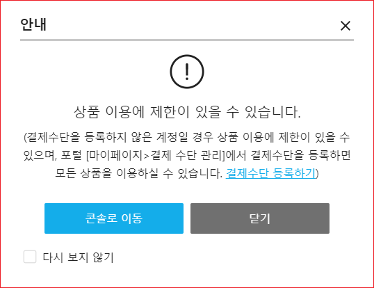
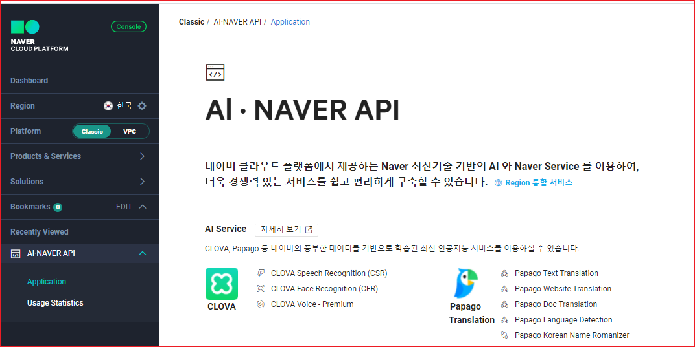
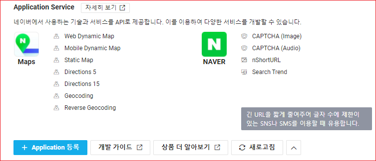
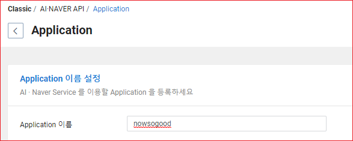
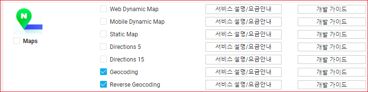
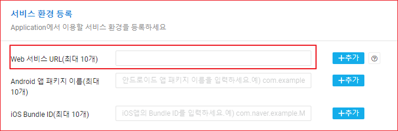
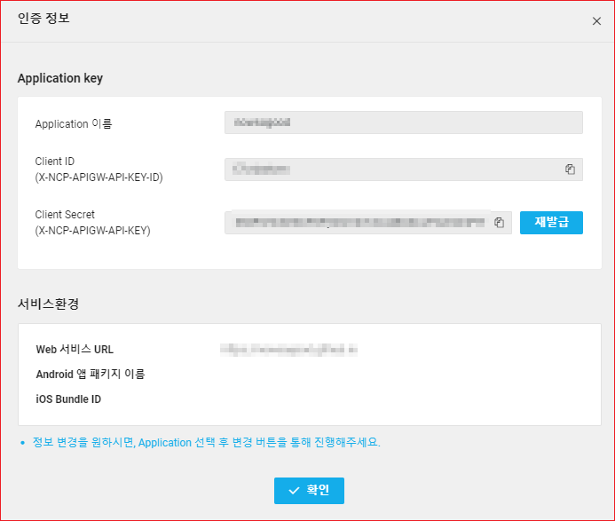

# Naver Cloud Console 설정

네이버 클라우드 콘솔에 로그인한다. 네이버 지도 API 페이지로 이동한다. 아래 그림과 같이 '이용 신청하기' 버튼이 보인다. 이것을 클릭한다.

결재 정보가 없으면 나중에 이용에 제한이 있을 수 있다고 한다. 결재수단을 등록한다.

[Naver Cloud Console](https://www.ncloud.com)

[지도 API](https://www.ncloud.com/product/applicationService/maps)

결재 수단을 등록하고 다시 '이용 신청하기' 버튼을 크ㅜㄹ긱하면 API 홈으로 이동한다. 다음과 같은 화면이 보일 것이다.

하단에 보면 'Application 등록' 버튼이 보인다. 클릭한다.

이용약관 화면이 표시된다. 약관에 동의하고 '확인' 버튼을 클릭한다.

Application 이름을 입력한다. 

아래에 Application에서 사용할 서비스를 선택한다.

하단의 서비스 환경 등록 섹션에서 'Web Service URL'을 입력하고 '추가' 버튼을 클릭한다. 

맨 하단에 '등록' 버튼을 클릭한다. 등록한 Appliation 정보가 표시된다.

'인증정보' 버튼을 클릭한다. Application 인증정보가 표시된다.

자세한 정보는 다음을 참고한다.

[Naver Application 사용 가이드](https://guide.ncloud-docs.com/docs/ko/naveropenapiv3-application)
