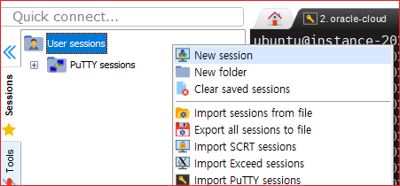

# 오라클 클라우드 접속하기

Orcle Cloud에 SSH로 접속하려면 Putty를 이용하여 접속해야 하는데 VM 인스턴스를 생성할 때 공개키를 등록해야 한다. 공개키는 Putty Key Generator를 사용하여 생성하고 생성된 공개키를 복사해서 인스턴스 생성화면에서 '공개키 붙여 넣기'로 붙여 넣어야 한다. 인스턴스 생성할 때 등록하지 않으면 아무리 노력해도 접속이 불가능하다.

## 키 생성

Putty Key Generator는 Putty를 설치하면 Putty를 설치한 폴더에 들어 있다.

Putty Key Generator를 실행한다. 다른 설정은 변경할 필요가 없이 디폴트 상태에서 'Generate' 버튼을 클릭한다.

런데 계속 마우스를 화면위에서 움직여야한다. 마우스의 움직임을 가지고 키를 생성한다. 계속하면 완료된다.

이미지에서 하이라이트된 부분이 공개키이다. Key passphrase 에 원하는 비밀번호를 입력한다. 비밀번호를 입력하지 않으면 SSH 접속할 때 비밀번호 없이 바로 접속이 가능하다. 공개키를 복사하여 인스턴스 생성화면의 '공용키 붙여넣기' 옵션을 선택하고 붙여 넣는다.

## 개인키 저장

'Save Private key' 버튼을 클릭하여 원하는 위치에 저장한다. 이 파일이 없으면 Putty로 로그인할 수 없다.

## Oracle Cloud 로그인

### Putty를 이용한 로그인

putty를 실행한다. 'Host Name(or IP address)'에 접속 아이피를 입력한다.

Connection>SSH>Auth를 선택한다. 'Browse' 버튼을 클릭하여 개인키 파일을 설정한다.

마지막으로 'Open' 버튼을 클릭하여 접속한다.

> putty는 최신버전을 사용했다. 나의 경우는 0.75 버전이다.

### MobaXTerm을 이용한 로그인

Putty 보다는 MobaXTerm을 쓰는 것이 UI도 편리하고 쉽다. 그런데 접속하려다 보면 "Putty key format too new"라고 오류가 나온다. Putty를 설치하면 Putty가 설치된 디렉토리에 puttygen.exe 파일이 존재하는데 최신 버전의 key 파일을 이전 버전의 키 파일로 변경하는 옵션이 있다. 이 파일을 사용하면 MobaXTerm 뿐만 아니라 WinSCP 프로그램도 사용할 수 있다.

'Key' 메뉴에 보면 'Parameters for saving key files.'라는 서브 메뉴가 있다. 이것을 클릭한다.

창이 표시되면, 'PPK file version'의 값을 '2'로 설정한다. 'OK' 버튼을 클릭한다. 

'Save privete key' 버튼을 클릭하여 적당한 위치에 개인키 파일을 저장한다.

MobaxTerm의 왼쪽의 Sessions 탭에서 우측 마우스 버튼을 클릭하여 New Session을 선택한다. 

'SSH' 버튼을 클릭한다. 

'Remote Host'에 IP를 입력하고 'Specify username'에 'ubuntu'를 입력한다. 

'Advanced SSH Settings' 탭을 클릭하고 'Use Private key'를 체크한다. 그리고 이전에 저장한 개인키를 선택한다. 

아래 OK 버튼을 클릭하고 저장을 한다. 'Sessions' 탭에서 생성한 커넥션을 더블 클릭하면 다음과 같이 접속이 될 것이다.

### WinSCP를 이용한 로그인

'파일 프로토콜'은 SFTP를 선택한다. '호스트 이름'에 IP를 입력한다. 사용자 이름에 'ubuntu'를 입력한다. '고급' 버튼을 클릭한다.

'SSH>인증'을 클릭하고 '개인키 파일'에 저정된 개인키를 선택한다.

생성한 세션을 클릭하여 로그인한다. 오른쪽에 ubuntu 사용자의 홈디렉토리가 표시될 것이다.

