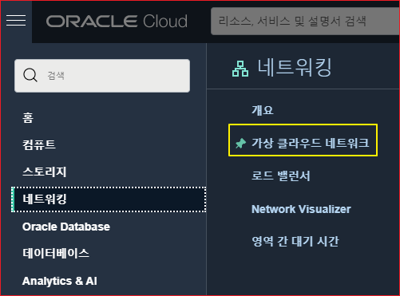
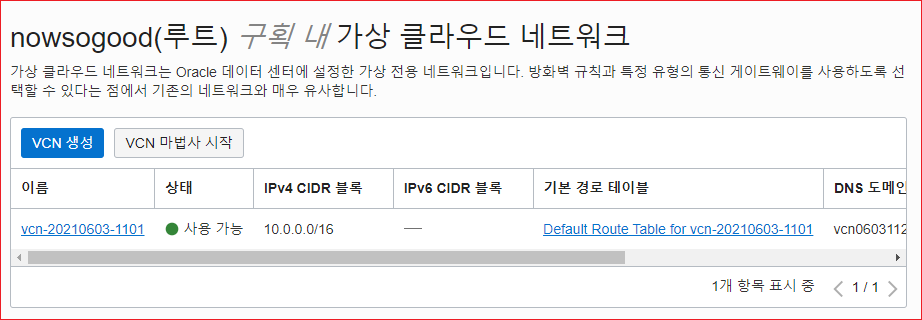
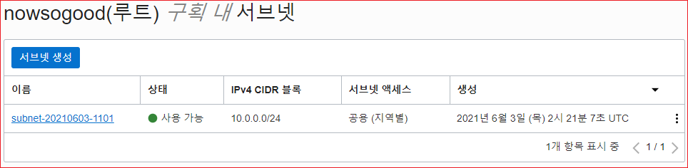
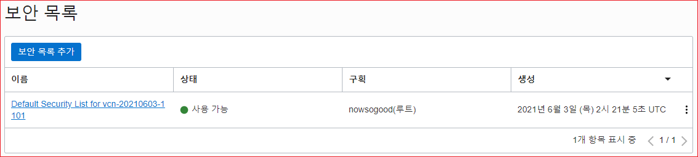
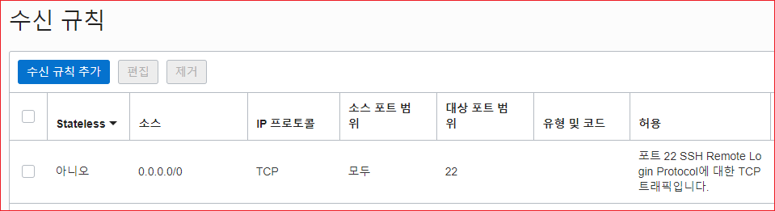
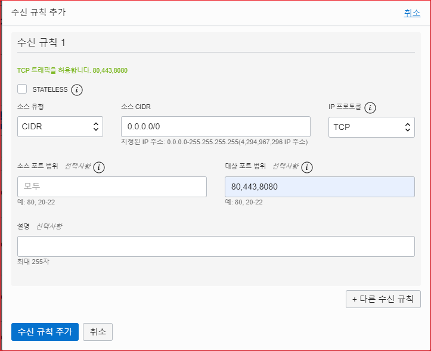
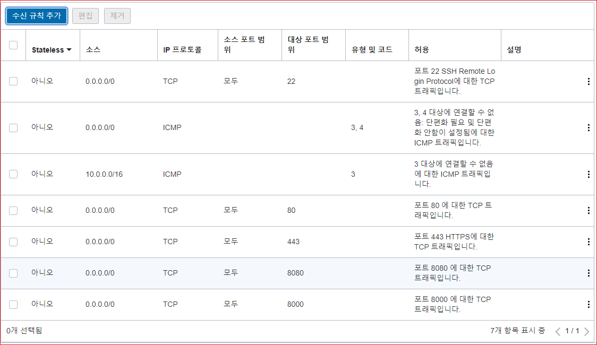

# Oracle Cloud 네트워크/방화벽 설정

## 클라우드 콘솔에서 네트워크 설정

왼쪽 네비게이션 메뉴의 "네트워킹"을 클릭하고 "가상 클랑우드 네트워크"를 클릭한다.



'루트 구획 내 가상 클라우드 네트워크' 화면에서 VM 생성할 때 생성된 네트워크 구성이 보일 것이다. 링크를 클릭한다.




'루트 구획 내 서브넷' 화면에서 생성된 서브넷 링크를 클릭한다. 




서브넷 화면이 표시되면 생성된 보안 목록이 모일 것이다. 링크를 클릭한다. 




수신 규칙 화면에서 '수신 규칙 추가' 버튼을 클릭한다. 




수신규칙 설정 화면에서 '소스유형은' 그대로 두고 '소스에 '0.0.0.0/0'으로 설정한다. 모든 곳에서 오는 아이피를 허용하겠다는 의미이다. IP 프로토콜은 디폴트인 TCP로 둔다. 소스 포트 범위는 입력하지 않는다. 이제 외부에서 들어오는 모든 접속 중에서 허용할 VM의 포트를 설정한다. 콤마를 사용하여 여러개 지정할 수 있다. 80번, 443, 8080을 허용한다.




입력을 다 했으면 '수신 규칙 추가' 버튼을 클릭한다. 설정된 수신규칙이 목록에 보일 것이다.




이제 VM 인스턴스에 접속해서 방화벽 설정을 변경해야 한다.

## VM Instances에서 방화벽 설정 변경

먼저 Network Device를 확인한다. ifconfig로 확인 가능하다. 우분투에서는 'ip addr'로 확인 가능하다.

```shell

ubuntu@instance-20210604-1640:~$ ip addr
1: lo: <LOOPBACK,UP,LOWER_UP> mtu 65536 qdisc noqueue state UNKNOWN group default qlen 1000
    link/loopback 00:00:00:00:00:00 brd 00:00:00:00:00:00
    inet 127.0.0.1/8 scope host lo
       valid_lft forever preferred_lft forever
    inet6 ::1/128 scope host
       valid_lft forever preferred_lft forever
2: ens3: <BROADCAST,MULTICAST,UP,LOWER_UP> mtu 9000 qdisc pfifo_fast state UP group default qlen 1000
    link/ether 02:00:17:00:fc:84 brd ff:ff:ff:ff:ff:ff
    inet 10.0.0.101/24 brd 10.0.0.255 scope global ens3
       valid_lft forever preferred_lft forever
    inet6 fe80::17ff:fe00:fc84/64 scope link
       valid_lft forever preferred_lft forever
ubuntu@instance-20210604-1640:~$
```

목록의 두번째 디바이스의 이름이 ' ens3'이다. 기억해 놓는다.

다음과 같이 입력한다. '--dport 80' 80번 포트를 허용한다는 것이다. 여기서는 iptables 명령에 대해서 자세히 설명하지 않는다.

```shell
sudo iptables -I INPUT 5 -i ens3 -p tcp --dport 80 -m state --state NEW,ESTABLISHED -j ACCEPT
```

443 포트도 허용한다.

```shell
sudo iptables -I INPUT 5 -i ens3 -p tcp --dport 443 -m state --state NEW,ESTABLISHED -j ACCEPT
```

8080 포트도 허용한다.

```shell
sudo iptables -I INPUT 5 -i ens3 -p tcp --dport 8080 -m state --state NEW,ESTABLISHED -j ACCEPT
```

> 그런데 8080 포트는 아무리 접속을 시도해도 접속이 되지 않았다. Tomcat 포트를 8000으로 변경한 이후에는 접속이 가능했다.

설정된 iptaables 정보 확인

```shell
sudo iptables --list
```

iptables 명령어를 실행 후 방화벽을 재 실행하거나 재부팅하면 보안 정책이 적용되지 않는다. 방화벽 정책을 재 부팅 시에도 유지하기 위해서는 iptables-persistent 패키지를 설치하고 netfilter-persistent save​​ 명령어로 보안 정책을 저장을 해야 한다.

방화벽 정책을 저장

```shell
sudo netfilter-persistent save​
```

아래 것은 확인해 보아야 함.

```shell
sudo service netfilter-persistent save​
```

방화벽 정책을 다시 로드

```shell
sudo netfilter-persistent start
```
